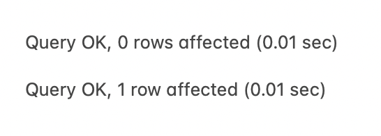

# 📖 Execute a SQL File Using MySQL Shell

Work with a partner to implement the following user story:

* As developer, I want to execute MySQL statements from a file using the command-line interface.

## Acceptance Criteria

* It's done when the `schema.sql` file is executed using the command-line interface and a message reading `Query OK` is returned.

## 📝 Notes

Refer to the documentation:

[MySQL documentation on installing and starting MySQL](https://dev.mysql.com/doc/mysql-getting-started/en/#mysql-getting-started-installing)

[MySQL documentation on executing SQL statements from a text file](https://dev.mysql.com/doc/refman/8.0/en/mysql-batch-commands.html)

## Assets

The following image demonstrates the web application's appearance and functionality:

---

## 💡 Hints

Which commands do you use to start MySQL in the command line?

## 🏆 Bonus

If you have completed this activity, work through the following challenge with your partner to further your knowledge:

* What kind of database is MySQL?

Use [Google](https://www.google.com) or another search engine to research this.

---
© 2024 edX Boot Camps LLC. Confidential and Proprietary. All Rights Reserved.

## Notes from Class
SQL make it easy to handle large amounts of data and scale up quickly

- A relational database organizes data into tables. A Table holds a group of data and is divided into rows and columns. The tables can be linked to form relationships

- Keys identify rows of data in a table. By matching Keys between two tables a relationship is formed!!

### SQL Queries
- A SQL query interacts with data in a database using the names of tables columns, and relationships betweeen tables. 
- Queries enable us to supply data to the front end to build sites that can interact with lots of data quickly and easily